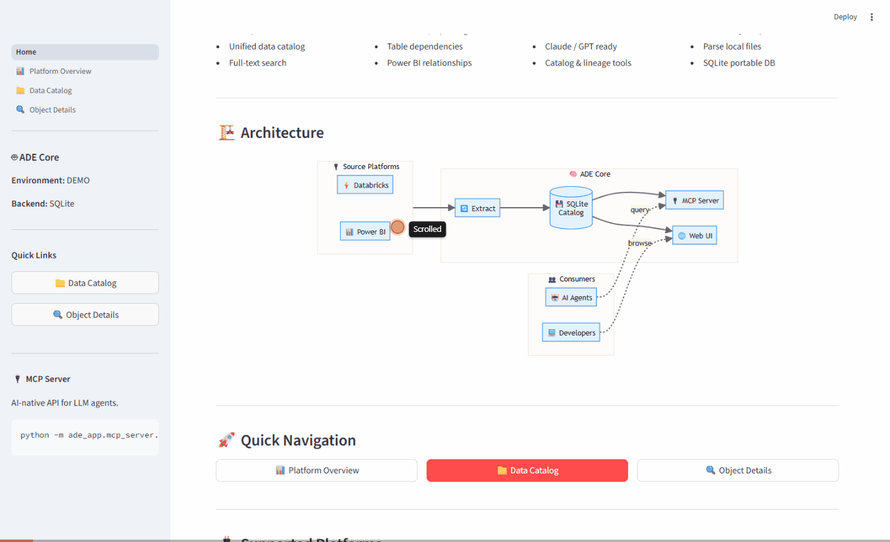

# Agentic Data Engineer (ADE) - Core

**ADE** provides the structured context that transforms AI agents from code assistants into autonomous data engineering partners.



## What it does

- **Extract** → Pull metadata from Databricks notebooks and Power BI semantic models
- **Parse** → Analyze source code to discover table lineage and DAX expressions
- **Search** → Find any data asset across platforms from Claude
- **Trace** → Map dependencies between notebooks, tables, and measures

## Why

In data engineering, context is scattered: SQL in views, DAX in Power BI, PySpark in notebooks, YAML in pipelines. There's no single repo to read.

ADE collects this context into a single SQLite catalog and makes it queryable — so AI agents can actually help.

## Quick Start

```bash
# 1. Clone and install
git clone https://github.com/rbutinar/ade-core.git
cd ade-core
pip install -r requirements.txt

# 2. Build the demo catalog
python -m ade_app.scripts.build_demo_catalog

# 3. Open with Claude Code — MCP server starts automatically

# 4. (Optional) Launch the web catalog
streamlit run ade_app/streamlit_app/Home.py
```

## Use with Claude

ADE works with any Claude client that supports MCP (Model Context Protocol).

### Claude Code

The `.mcp.json` in the repo auto-starts the server. Just open the project:

```bash
cd ade-core
claude
```

### Claude Desktop

Add to your config file:
- **Windows**: `%APPDATA%\Claude\claude_desktop_config.json`
- **Mac**: `~/Library/Application Support/Claude/claude_desktop_config.json`

```json
{
  "mcpServers": {
    "ade": {
      "command": "python",
      "args": ["-m", "ade_app.mcp_server.server"],
      "cwd": "/path/to/ade-core"
    }
  }
}
```

### Then you can ask:

```
"What notebooks do we have in the demo environment?"
"Show me the DAX for Total Sales"
"What tables does 01_ingest_raw_sales write to?"
"Find all measures in the Power BI model"
"Trace the lineage from bronze to gold"
```

## Available MCP Tools

| Tool | Description |
|------|-------------|
| `get_environment_info()` | Environment overview (platforms, stats, backend) |
| `search_catalog(query)` | Full-text search across all platforms |
| `get_object_details(name)` | Full metadata, source code, and children |
| `get_notebook_lineage(name)` | Input/output table dependencies |

## Supported Platforms

| Platform | Status | What it parses |
|----------|--------|----------------|
| Databricks | Ready | `.py` notebooks from disk — extracts table lineage (inputs/outputs) with variable resolution |
| Power BI | Ready | TMDL files from PBIP projects — tables, columns, measures (DAX), relationships |
| PostgreSQL | Coming | Tables, views, SQL definitions |

## Extract Your Own Data

### Databricks notebooks (local files)

Place your exported `.py` notebooks under `ade_data/<env>/inputs/databricks/` and rebuild:

```bash
python -m ade_app.scripts.build_demo_catalog
```

### Power BI semantic model (TMDL)

Place your PBIP definition folder under `ade_data/<env>/inputs/powerbi/` and rebuild:

```bash
python -m ade_app.platforms.powerbi.extractor \
    --path ade_data/my_env/inputs/powerbi/MyModel.SemanticModel/definition \
    --db ade_data/my_env/catalog.db
```

### Databricks via API (optional)

```bash
python -m ade_app.platforms.databricks.extractor \
    --host https://your-workspace.azuredatabricks.net \
    --token your_databricks_token \
    --db ade_data/my_env/catalog.db
```

## Web Catalog UI

Browse the metadata catalog in your browser:

```bash
streamlit run ade_app/streamlit_app/Home.py
```

**Pages:**
- **Home** — Catalog stats, architecture diagram, quick navigation
- **Platform Overview** — Per-platform object counts and breakdown
- **Data Catalog** — Full-text search with platform/type filters
- **Object Details** — Full metadata, children, Databricks lineage graph, Power BI relationship diagram

## Project Structure

```
ade-core/
├── ade_app/
│   ├── core/                     # CatalogDB (SQLite backend)
│   ├── platforms/
│   │   ├── databricks/           # Notebook parser + I/O lineage
│   │   ├── powerbi/              # TMDL parser + extractor
│   │   └── postgresql/           # Coming soon
│   ├── mcp_server/               # MCP server for AI agents
│   ├── streamlit_app/            # Web catalog UI
│   │   ├── Home.py               # Landing page
│   │   └── pages/                # Platform Overview, Data Catalog, Object Details
│   └── scripts/                  # CLI utilities
├── ade_data/
│   └── demo/                     # Demo environment (synthetic data)
│       └── inputs/
│           ├── databricks/       # .py notebook files
│           └── powerbi/          # TMDL definition files
├── tests/                        # 117 tests
├── .mcp.json                     # Auto-start MCP server config
├── requirements.txt
└── README.md
```

## Demo Data

The demo environment contains a synthetic **Acme Corp** data platform:

**Databricks** — 5 PySpark notebooks implementing a Lakehouse pipeline:
```
/mnt/raw/sales/ → bronze.raw_sales → silver.clean_sales → gold.daily_sales
                                                         → gold.monthly_sales
bronze.raw_customers + silver.clean_sales → silver.enriched_customers
```

**Power BI** — AcmeSales semantic model with 4 tables, 5 DAX measures, 3 relationships.

## ADE Extended (private)

Additional platforms available in the extended version:

| Platform | Features |
|----------|----------|
| Microsoft Fabric | Warehouses, lakehouses, pipelines, notebooks, semantic models |
| Talend | Jobs, components, data flows |
| Tableau | Workbooks, datasources, worksheets |
| SQL Server / SSIS | Packages, data flows, connections |
| Cloudera | Hive tables, Spark jobs |
| Synapse | Pools, procedures, views |

The extended version also includes SQL Server metadata store with full lineage graph, multi-environment management, platform deployment skills, and cross-platform impact analysis.

*Interested? Contact: roberto.butinar@gmail.com*

## The Autonomous Data Engineer

This project powers **The Autonomous Data Engineer** video series on YouTube, showing real agentic workflows for data platforms.

- [YouTube Channel](https://youtube.com/@autonomous-data-engineer)

## License

Apache 2.0 — See [LICENSE](LICENSE)

## Author

**Roberto Butinar** — Data Engineer & AI Automation Specialist

- [LinkedIn](https://linkedin.com/in/rbutinar)
- [GitHub](https://github.com/rbutinar)
